# Entity-Relationship Diagram

Foreign-key relationships in `public`. `source_run_id` references to
`apify_runs` are present on most ingested tables but are not enforced as
hard FKs, so they are not drawn here — join opportunistically by text
value.

```mermaid
erDiagram
    fb_profiles ||--o{ fb_posts                   : authors
    fb_profiles ||--o{ fb_comments                : commented
    fb_profiles ||--o{ fb_reactions               : reacted
    fb_profiles ||--o{ fb_photos                  : owns
    fb_profiles ||--o{ fb_content_experiments     : authored
    fb_profiles ||--o{ creator_briefings          : briefed_about

    fb_posts    ||--o{ fb_comments                : has
    fb_posts    ||--o{ fb_reactions               : has
    fb_posts    ||--o{ fb_post_engagement_snapshots : snapshot_of
    fb_posts    ||--o{ comment_queue              : queued_for
    fb_posts    ||--o{ fb_content_experiments     : post_of
    fb_posts    ||--o{ fb_content_experiments     : baseline_of

    fb_comments ||--o{ fb_comments                : parent_of
    fb_comments ||--o{ comment_queue              : reply_to

    places      ||--o{ web_contacts               : contact_for

    apify_runs  ||--o{ triage_inbox               : flagged_from

    topic_clusters ||--o{ content_topic_assignments : grouped_in

    fb_profiles {
        uuid profile_id PK
        text fb_user_id UK
        text username
        text display_name
        profile_role role "self|tracked|audience"
        int  followers_count
        timestamptz last_posts_pull_at
    }

    fb_posts {
        uuid post_id PK
        text fb_post_id UK
        uuid author_profile_id FK
        timestamptz posted_at
        text text
        int  likes_count
        int  comments_count
        int  shares_count
        bool has_media
        bool is_shared_post
    }

    fb_comments {
        uuid comment_id PK
        text fb_comment_id UK
        uuid post_id FK
        uuid parent_comment_id FK
        uuid commenter_profile_id FK
        text text
        timestamptz posted_at
        int  threading_depth
    }

    fb_reactions {
        uuid reaction_id PK
        uuid post_id FK
        uuid reactor_profile_id FK
        reaction_kind reaction_type
    }

    fb_photos {
        uuid photo_id PK
        text fb_photo_id UK
        uuid owner_profile_id FK
        text image_url
    }

    fb_post_engagement_snapshots {
        uuid snapshot_id PK
        uuid post_id FK
        timestamptz captured_at
        int  likes_count
        int  comments_count
    }

    fb_content_experiments {
        uuid experiment_id PK
        uuid post_id FK
        uuid baseline_post_id FK
        uuid author_profile_id FK
        text status
        text primary_modifier
        jsonb outcomes
    }

    creator_briefings {
        uuid briefing_id PK
        uuid profile_id FK
        date briefing_date
        text markdown
        jsonb summary
    }

    comment_queue {
        uuid queue_id PK
        uuid post_id FK
        uuid parent_comment_id FK
        text draft_text
        comment_queue_status status
    }

    apify_runs {
        text run_id PK
        text actor_name
        text status
        timestamptz started_at
        numeric cost_usd
    }

    triage_inbox {
        uuid item_id PK
        text source_run_id FK
        text kind
        triage_status status
    }

    places {
        uuid place_id PK
        text google_place_id UK
        text name
        text city
        text website
    }

    web_contacts {
        uuid contact_id PK
        text domain UK
        uuid place_id FK
        text[] emails
        text grade
    }

    email_verifications {
        text email PK
        text status
        int  score
    }

    web_pages {
        uuid page_id PK
        text url UK
        text title
        text markdown
    }

    screenshots {
        uuid screenshot_id PK
        text source_url
        text screenshot_url
    }

    content_embeddings {
        uuid id PK
        text content_type
        uuid content_id
        text model_name
        vector embedding_1536
    }

    content_analyses {
        uuid id PK
        text content_type
        uuid content_id
        text analysis_type
        jsonb result
    }

    topic_clusters {
        uuid id PK
        text cluster_label
        text[] keywords
    }

    content_topic_assignments {
        uuid id PK
        text content_type
        uuid content_id
        uuid cluster_id FK
        numeric similarity
    }

    content_processing_status {
        uuid id PK
        text content_type
        uuid content_id
        text processor
        text status
    }
```

## Polymorphic content references (not drawn above)

The NLP layer uses `(content_type, content_id)` instead of typed FKs.
`content_type` can be one of:

- `fb_post`        → `fb_posts.post_id`
- `fb_comment`     → `fb_comments.comment_id`
- `fb_profile_bio` → `fb_profiles.profile_id`
- `messenger_msg`  → (no table yet)
- `other`          → arbitrary

Tables using this pattern: `content_embeddings`, `content_analyses`,
`content_topic_assignments`, `content_processing_status`.
